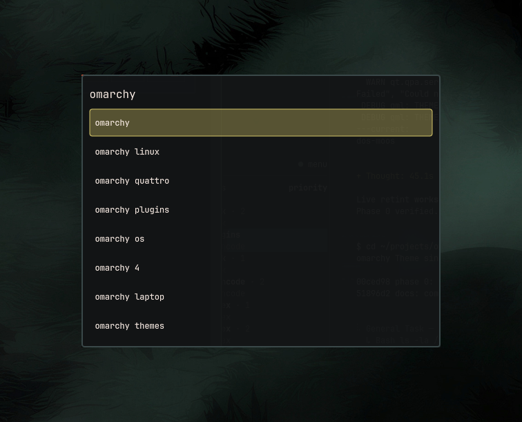

# oxhenri.search

Web-search overlay for [Omarchy](https://github.com/basecamp/omarchy).
Same surface as the Omarchy menu: type a query, pick a suggestion, **Enter**
opens results in your default browser.



## Install

```sh
omarchy plugin add https://github.com/Dev-Herni/oxhenri.search.git --enable
```

Bind a hotkey in `~/.config/hypr/bindings.lua`:

```lua
o.bind("SUPER + SHIFT + L", "Web search", "omarchy-shell shell toggle oxhenri.search")
```

Then `hyprctl reload`. Press **Super+Shift+L** to search.
Any free combo works — change `SUPER + SHIFT + L` if you prefer.
You can also edit this from **Omarchy menu → Setup → Keybindings**.

## Keys

| Key | Action |
|-----|--------|
| Type | Live suggestions appear |
| `↑` `↓` | Move through suggestions |
| `Tab` | Fill the selected suggestion into the search box |
| `Enter` | Search — opens results in your browser |
| Click a suggestion | Search it right away |
| `Esc` / click outside | Close the overlay |

## Requirements

- [Omarchy](https://github.com/basecamp/omarchy) / `omarchy-shell`
- Network access for [Google Suggest](https://suggestqueries.google.com/) and search
- A default browser (`xdg-open`)

No extra packages. The plugin writes no files outside its own folder.

## Uninstall

```sh
omarchy plugin remove oxhenri.search --yes
```

Remove the keybinding from `~/.config/hypr/bindings.lua` if you added one.

## License

MIT — see [LICENSE](LICENSE).
